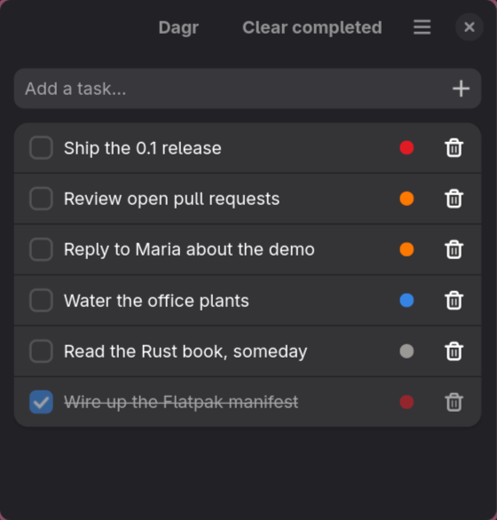

<p align="center">
  <picture>
    <source media="(prefers-color-scheme: dark)" srcset="site/logo-dark.svg">
    
  </picture>
</p>

<p align="center">
  <a href="https://github.com/alebles/dagr/actions/workflows/ci.yml"></a>
  <a href="LICENSE"></a>
  <a href="https://www.rust-lang.org"></a>
  <a href="https://dagr.bles.nu"></a>
</p>

A tiny, keyboard-first task list for Linux. One window, one priority-ordered list, and everything a single click away - plus a background service that lets an AI assistant, or your desktop, do anything you can.

> _"Skinfaxi they name the steed that draws the shining day over mankind — brightest of horses he seems to men, and ever his mane is aflame with light."_
> — Vafþrúðnismál, of the horse that bears Dagr across the sky

<p align="center">
  
</p>

## Features

- **One click for everything** - complete, rename, re-prioritize, or delete without a menu or a dialog in sight.
- **Priority-ordered** - user-defined levels with names and colors; the order you set is the order the list sorts. Reorder by dragging or with the arrows.
- **Type to add** - the entry is focused on launch; before the task itself, a leading `!`, `!!`, `!!!` bumps its priority, a `#tag` labels it, and an `@list` files it.
- **Labels** - optional colored tags, as many per task as you like, shown as dots on the row. Off until you turn them on.
- **Lists** - optional; a sidebar of lists you add, rename, reorder and remove, with "All tasks" on top. Deleting a list moves its tasks rather than dropping them. Off until you turn them on.
- **Undo, not confirm** - deletes and "clear completed" drop a toast with Undo instead of asking first.
- **Adjustable** - turn priorities, labels or lists off entirely, choose the sort order, group the list by the day a task was added, set the default priority and list, all in Preferences.
- **AI-native** - a background service hosts an MCP endpoint over local HTTP, sharing one database with the open window and outliving it.
- **Scriptable from your desktop** - the same service answers a Unix socket, which is how the [launcher plugin](https://github.com/alebles/dms-spotlight-tasks) adds tasks from a spotlight search.
- **English and Dutch** - the app follows your system language, with an override in Preferences.
- **Native GNOME look** - GTK 4 + libadwaita, following the system light/dark style and accent color. Runs on any Linux desktop (developed on Hyprland), no GNOME shell required.
- **Local and private** - a single SQLite file in your data directory. No account, no cloud, no telemetry.

## Install

Dagr is **not on Flathub**, and not in any distro repository. Releases live on GitHub.

### Flatpak

Every tagged release attaches a sandboxed `dagr.flatpak` bundle built by CI. Download it from the [latest release](https://github.com/alebles/dagr/releases/latest) and install the file directly:

```bash
# Flathub is only used for the GNOME runtime the bundle needs, not for Dagr itself
flatpak remote-add --user --if-not-exists flathub https://dl.flathub.org/repo/flathub.flatpakrepo
flatpak install --user dagr.flatpak
flatpak run nu.bles.dagr
```

**A Flatpak install puts no `dagr` command on your PATH.** Worth knowing before anything else here makes sense: every `dagr …` line below assumes one exists. Make one:

```bash
mkdir -p ~/.local/bin
printf '#!/bin/sh\nexec flatpak run nu.bles.dagr "$@"\n' > ~/.local/bin/dagr
chmod +x ~/.local/bin/dagr
```

Tasks live in `~/.var/app/nu.bles.dagr/data/dagr/dagr.db`. Note that a source build uses `~/.local/share/dagr/dagr.db` instead, so running both gives you two separate lists - `dagr status` prints which one is being served.

### From source

Needs a Rust toolchain and the GTK 4 / libadwaita development files.

```bash
sudo dnf install rust cargo gtk4-devel libadwaita-devel   # Fedora
sudo apt install cargo libgtk-4-dev libadwaita-1-dev      # Debian / Ubuntu
sudo pacman -S rust gtk4 libadwaita                       # Arch

cargo run --release
```

Needs GTK ≥ 4.18 and libadwaita ≥ 1.7 (the versions the bindings are gated to; the code itself only uses APIs from GTK 4.12 / libadwaita 1.5). To put `dagr` on your PATH with a launcher entry:

```bash
cargo install --path .
install -Dm644 data/nu.bles.dagr.desktop ~/.local/share/applications/
```

### Building the Flatpak yourself

```bash
flatpak install --user flathub org.gnome.Sdk//50 \
  org.freedesktop.Sdk.Extension.rust-stable//25.08 org.flatpak.Builder
flatpak run org.flatpak.Builder --user --install --force-clean \
  build-aux/build-dir build-aux/nu.bles.dagr.json
flatpak run nu.bles.dagr
```

Crates are vendored for the offline sandbox build in `build-aux/cargo-sources.json`; regenerate it after changing `Cargo.lock` with `build-aux/generate-cargo-sources.py`.

## Usage

The window opens with the entry focused. Type a task, press Enter, and keep going.

| Action | How |
|---|---|
| Add a task | Type and press Enter (`!`, `!!`, `!!!` set the priority, `#tag` adds a label, `@list` files it) |
| Complete | Click the checkbox - it sinks to the bottom, struck through |
| Rename | Click the title, edit, Enter (Esc cancels) |
| Re-prioritize | Click the colored dot, pick a level |
| Label a task | Click the bookmark icon, tick the labels - they apply when the popover closes |
| Switch list | Click it in the sidebar; "All tasks" shows every list at once |
| Manage lists | `+` in the sidebar header to add, click a name to rename, drag the grip to reorder, trash to delete (its tasks move) |
| Reorder priorities | Drag the grip, or use the arrows, in Preferences |
| Delete | Click the trash icon - a toast offers Undo |
| Clear completed | Button in the header bar when anything is done |

**Shortcuts:** `Ctrl+N` focus the entry, `Ctrl+Shift+D` clear completed, `Ctrl+,` preferences (`Ctrl+1`…`Ctrl+5` switch its pages), `Ctrl+Q` quit.

**Preferences** covers what to make adjustable: switch priorities, labels or lists on or off, choose the sort order (priority, oldest, newest, or alphabetical), put the date before priority so older days rise to the top, set the default priority and the default list for new tasks, choose which list the window opens on, manage the priority levels and the labels themselves, pick the language, and set the size the window opens at.

## Languages

Dagr speaks English and Dutch. It follows the system language by default and takes an override in Preferences → Settings → Language, which applies the next time it starts - the toolkit picks its own language once, at launch.

Every string lives in [`locales/app.yml`](locales/app.yml), English and Dutch side by side, so adding a language is one column in one file plus a line in `SUPPORTED` in `src/i18n.rs`. A test walks that file and fails if any string is missing a translation. The names seeded into a new database - the "Tasks" list, the High/Medium/Low/None priorities - are translated once, when the database is created; after that they are your data and changing language leaves them alone. Strings an assistant reads (MCP tool descriptions, API errors) stay English on purpose: they are an interface contract.

## The background service

`dagr serve` runs without a window. It hosts the MCP endpoint and answers a Unix socket at `$XDG_RUNTIME_DIR/dagr/dagr.sock`. Everything below - AI access and desktop integration - goes through it, so set it up first.

The window starts one on demand if none is running, and it outlives the window being closed - but not a logout or a reboot. To have it come back on its own, run:

```bash
dagr setup
```

That prints the exact steps for your install, because they differ: a Flatpak needs the PATH shim above and a different `ExecStart`. What it amounts to is a systemd user service:

```bash
mkdir -p ~/.config/systemd/user
dagr serve --print-unit > ~/.config/systemd/user/dagr.service
systemctl --user enable --now dagr

dagr status        # which database, the MCP url, and whether anything is answering
```

`dagr status` decides by connecting to the socket rather than by looking for a status file, so it stays honest after a hard kill - which is what stopping the Flatpak service is, since `--die-with-parent` leaves no chance to clean up.

## AI access (MCP)

Dagr speaks the [Model Context Protocol](https://modelcontextprotocol.io) over Streamable HTTP at `http://127.0.0.1:<port>/mcp`, bound to loopback with no authentication. There is one MCP server and the background service hosts it, so it keeps working once you close the window.

Every action in the app is a tool: `list_tasks`, `add_task`, `update_task`, `delete_task`, `clear_completed`, `list_priorities`, `add_priority`, `update_priority`, `reorder_priorities`, `delete_priority`, `list_labels`, `add_label`, `update_label`, `delete_label`, `list_lists`, `add_list`, `update_list`, `reorder_lists`, `delete_list`, `get_settings`, `update_settings`. Priorities, labels and lists can be given by name or id; `update_task {labels: […]}` replaces a task's whole label set and `{list: "…"}` moves it. `list_tasks` follows the list the window is showing unless you pass `{list: "all"}` or a name.

This repo ships a project-scoped `.mcp.json`, so opening Claude Code here just works. From anywhere:

```bash
claude mcp add --transport http dagr http://127.0.0.1:7331/mcp
```

The endpoint can be switched off, and its port changed, in Preferences → AI access.

## Desktop integration

The service's Unix socket is there for desktop tooling that should not be poking at the database. [Spotlight Tasks](https://github.com/alebles/dms-spotlight-tasks) is one: a [DankMaterialShell](https://github.com/AvengeMedia/DankMaterialShell) launcher plugin that adds and completes tasks from a spotlight search.

It speaks one JSON object per line, both directions. Method names match the MCP tools:

```jsonc
{"event":"hello","protocol":1,"version":"0.2.0","db":"/home/…/dagr.db"}
{"id":1,"method":"list_tasks","params":{"include_done":false}}
{"id":1,"ok":true,"result":{"version":1235,"tasks":[…],"priorities":[…],"labels":[…],"lists":[…],"settings":{…}}}
{"event":"changed","version":1236}
```

`subscribe` turns on `changed` notifications, including for writes made straight to the database by the window. `list_tasks` returns tasks, priorities, labels, lists and settings together, because that is what a client needs to draw a list in one round trip. A task with no labels has no `labels` key at all, and while lists are off it has no `list` key either.

## Development

```bash
cargo test                                # unit + integration tests
cargo clippy --all-targets -- -D warnings # what CI enforces
cargo fmt --check
```

Integration tests in `tests/` drive a real `dagr serve` over its socket and over MCP, and need no display. CI runs fmt, clippy, and the tests on every push, and builds a Flatpak bundle.

Schema changes are made in place - there are no migrations before the first release. To start over, stop the service first, since it holds the database open:

```bash
systemctl --user stop dagr
rm ~/.local/share/dagr/dagr.db        # or ~/.var/app/nu.bles.dagr/data/dagr/dagr.db
```

## License

MIT - see [LICENSE](LICENSE).
